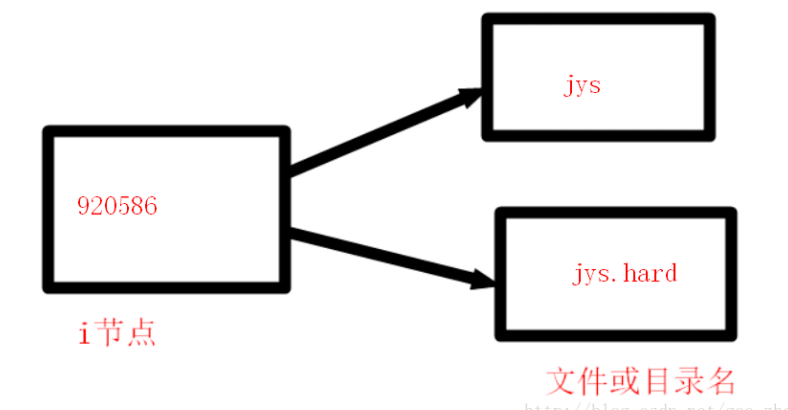

## 1. 硬链接和软连接区别?
- 建立软链接和硬链接的语法
``` 
软链接：ln -s 源文件 目标文件 
硬链接：ln 源文件 目标文件 
源文件：即你要对谁建立链接
```
-  什么是软链接和硬链接
>软链接可以理解成快捷方式。它和windows下的快捷方式的作用是一样的
>硬链接等于cp -p 加 同步更新

- 区别

软链接文件的大小和创建时间和源文件不同。软链接文件只是维持了从软链接到源文件的指向关系（从jys.soft->jys可以看出），不是源文件的内容，大小不一样容易理解。 
硬链接文件和源文件的大小和创建时间一样。硬链接文件的内容和源文件的内容一模一样，相当于copy了一份。

- 延伸 1

但是简单的copy的文件创建文件的时间应该是复制文件时的时间，肯定不会像硬链接那样和创建源文件的时间相同。你想的没错！
但是只要加一个选项-p,时间就一样了 。

那么cp -p的文件是不是就相当于硬链接了呢？其实不然，对于源文件的内容有修改，
硬链接文件会同步更新修改，始终保持和源文件的内容相同，而复制的文件则不可能做到这一点。

所以，硬链接等于cp -p加同步更新。 

软链接像快捷方式，方便我们打开源文件，这一点在windows中深有体会，那硬链接有哪些应用呢？ 
在多用户的操作系统里，你写一个脚本，程序等，没有完成，保存后等下次有时间继续写，
但是其他用户有可能将你未写完的东西当成垃圾清理掉，这时，你对你的程序，脚本等做一个硬链接，
利用硬链接的同步更新，就可以方式，别人误删你的源文件了。

- 删除源文件对软链接和硬链接的影响

`执行删除源文件操作`

查看软链接文件，查看的文件不存在。和windows一样，删除源文件，快捷方式也用不了。但是删除源文件，为什么硬链接文件还可以查看呢？ 
这里要简单说下i节点了。i节点是文件和目录的唯一标识，每个文件和目录必有i节点，不然操作系统就无法识别该文件或系统，就像没有上户口的黑户。
linux操作系统是不识别些字母的，像这些jys ,jys.hard操作系统根本不知道是什么玩意。

可以看出硬链接文件和源文件i节点号相同，并且一个i节点可以对应多个文件名。



如图，删除了jys,只是删除了从920586到jys的映射关系，不影响它和jys.hard的映射关系。
此图也解释了硬链接的同步更新，对源文件修改，操作系统只认i节点，
于是操作系统就将修改内容写进所有i节点相同名字不同的文件。

## 2. DNS解析过程

1. 在浏览器中输入www.qq.com域名，操作系统会先检查自己本地的hosts文件是否有这个网址映射关系，
   如果有，就先调用这个IP地址映射，完成域名解析。 
2. 如果hosts里没有这个域名的映射，则查找本地DNS解析器缓存，是否有这个网址映射关系，
   如果有，直接返回，完成域名解析。 
3. 如果hosts与本地DNS解析器缓存都没有相应的网址映射关系，首先会找TCP/ip参数中设置的首选DNS服务器，
   在此我们叫它本地DNS服务器，此服务器收到查询时，如果要查询的域名，包含在本地配置区域资源中，
   则返回解析结果给客户机，完成域名解析，此解析具有权威性。 
4. 如果要查询的域名，不由本地DNS服务器区域解析，但该服务器已缓存了此网址映射关系，则调用这个
   IP地址映射，完成域名解析，此解析不具有权威性。 
5. 如果本地DNS服务器本地区域文件与缓存解析都失效，则根据本地DNS服务器的设置（是否设置转发器）
   进行查询，如果未用转发模式，本地DNS就把请求发至13台根DNS，根DNS服务器收到请求后会判断这个域名
   (.com)是谁来授权管理，并会返回一个负责该顶级域名服务器的一个IP。本地DNS服务器收到IP信息后，
   将会联系负责.com域的这台服务器。这台负责.com域的服务器收到请求后，如果自己无法解析，
   它就会找一个管理.com域的下一级DNS服务器地址(qq.com)给本地DNS服务器。
   当本地DNS服务器收到这个地址后，就会找qq.com域服务器，重复上面的动作，进行查询，
   直至找到www.qq.com主机。 
6. 如果用的是转发模式，此DNS服务器就会把请求转发至上一级DNS服务器，
   由上一级服务器进行解析，上一级服务器如果不能解析，或找根DNS或把转请求转至上上级，以此循环。
   不管是本地DNS服务器用是是转发，还是根提示，最后都是把结果返回给本地DNS服务器，
   由此DNS服务器再返回给客户机。

**从客户端到本地DNS服务器是属于递归查询，而DNS服务器之间就是的交互查询就是迭代查询。**

详细参考：https://www.cnblogs.com/smilenana/p/3414077.html

## 3. kill 用法，某个进程杀不掉的原因（进入内核态，忽略 kill 信号）
- kill用法

先用查看进程id命令   ps -ef  ， 然后用杀死进程    kill -9 PID

- 进程杀不掉的原因
1. 进程已经成为僵尸进程，当它的父进程将它回收或将它的父进程kill掉，此时进程已经释放所有的资源，
但是没有被父进程释放（所以僵尸进程的存在不会影响系统性能）。僵尸进程要等到父进程结束，
或者重启系统才可以被释放。

2. 该进程处于”kernel mode”（内核态）且在等待不可获得的资源（类似于挂起）。Linux进程运行时分内核和用户两种状态，当进程进入内核状态后，
会屏蔽所有信号，包括SIGNAL，所以这个时候kill -9也变得无效了

### 4. linux 用过的命令

略

### 5. 系统管理命令（如查看内存使用、网络情况）
- df  和  df -hl  用来检查文件系统的磁盘空间占用情况，使用权限是所有用户
- top,   top命令用来显示执行中的程序进程，使用权限是所有用户（想对进程进行实时监控应该用top命令）
- free,  free命令用来显示内存的使用情况，使用权限是所有用户
- lp,  lp是打印文件的命令，使用权限是所有用户
- useradd,   useradd命令用来建立用户帐号和创建用户的起始目录，使用权限是超级用户
- kill 杀死进程
- ps -ef  查看进程完整信息（PS显示的是进程瞬间状态，不连续）
- ps -aux列出目前所有正在内存中的进程信息
- netstat  查看网络状态
### 6. 管道的使用


